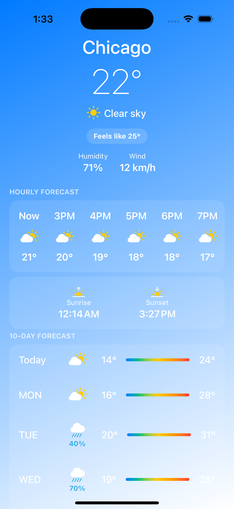
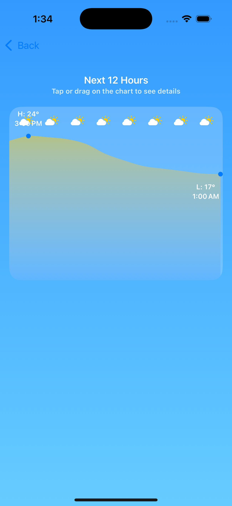
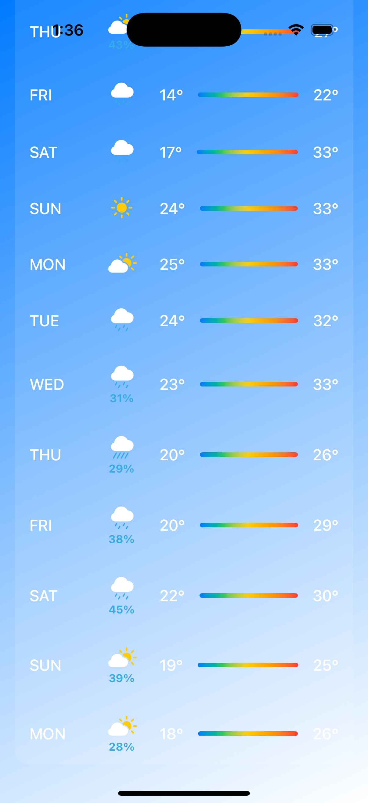
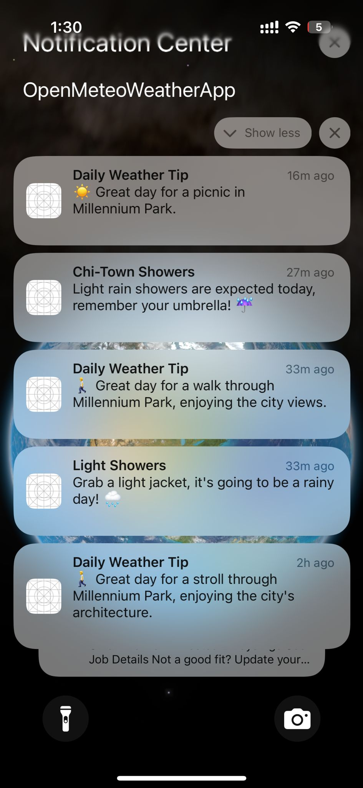

# OpenMeteo Weather Assistant

<br/>
<p align="center">
  <a href="https://github.com/vishnu32510/swift-weather-app">
    
  </a>
  <h1 align="center">OpenMeteo Weather Assistant</h1>
</p>

A modern, feature-rich weather assistant built natively for iOS using SwiftUI. This application goes beyond simple data display by integrating a powerful AI backend to provide users with personalized, context-aware activity suggestions and proactive, intelligent weather alerts.

## Key Features

- **Dynamic Main Dashboard:** A sleek, single-page UI built with SwiftUI that shows all essential weather data at a glance. The background dynamically adapts to the time of day (day/night).
- **Interactive Hourly Forecast Chart:** A beautiful and interactive chart, built with the SwiftUI Charts framework, that visualizes the next 12 hours of weather. Users can tap or drag to inspect temperature and conditions at any point.
- **Detailed Daily Forecast:** A daily forecast to help with long-term planning.
- **AI-Powered Suggestions:** The app's standout feature. It synthesizes current weather data into a summary and uses the Google Gemini API to generate a unique, actionable activity suggestion for the user.

## Advanced & Differentiating Features

### Proactive, Intelligent Notifications
The app leverages `BGTaskScheduler` to run tasks in the background, providing truly smart notifications that go far beyond standard weather alerts:
- **Precipitation Alerts:** The app monitors the hourly forecast and, upon detecting a high probability (>50%) of rain or snow, it will schedule a notification to be delivered to the user **one hour before the event occurs**.
- **LLM-Generated Content:** The title and body of these proactive alerts are dynamically generated by the Gemini LLM to be helpful and context-aware (e.g., "Heads Up!|Heavy rain is starting soon, you might want to grab an umbrella! ☔️").
- **AI-Powered Daily Tip:** A background task runs periodically (with a minimum 8-hour gap) to provide a 'Daily Weather Tip'. It analyzes the day's complete weather summary, sends it to the Gemini LLM, and delivers a creative and relevant activity suggestion as a push notification.
- **Daily 7 AM Forecast:** A conventional but useful daily summary notification.

[Watch the demo video](https://youtu.be/92IoX19Djtc)

<table>
  <tr>
    <td></td>
    <td></td>
    <td></td>
  </tr>
</table>

<table>
  <tr>
    <td></td>
    <td></td>
  </tr>
</table>

## Technical Implementation

### Architecture
- **MVVM-like:** A clean separation of concerns using Views, Models, and service-layer Managers.
- **Modern & Asynchronous:** Built entirely with modern Swift practices, including **SwiftUI** for the UI, `async/await` for concurrency, and the `Charts` framework for data visualization.

### Key Components
1.  **Weather Service:** Handles all API integration with the Open-Meteo API, including error handling.
2.  **LLM Service:** Manages all communication with the Google Gemini API for both suggestions and alert generation.
3.  **Weather Alert Manager:** A dedicated manager that contains the logic to analyze forecast data and trigger proactive, time-sensitive notifications.
4.  **Secure API Key Management:** API keys are stored securely using `.xcconfig` files and are not hardcoded or checked into the Git repository.

## Getting Started

### Prerequisites
- Xcode 15.0+
- iOS 17.0+
- A physical iOS device is recommended for testing notifications and background tasks.

### Installation & Setup

1.  **Clone the repository:**
    ```bash
    git clone https://github.com/vishnu32510/OpenMeteoWeatherApp.git
    cd OpenMeteoWeatherApp
    ```

2.  **Provide API Key (Crucial Step):**
    This project uses a `Secrets.xcconfig` file to protect the API key. This file is not checked into Git. You must create it yourself.
    -   Find the file `Secrets.xcconfig.template`.
    -   Duplicate this file and rename the copy to **`Secrets.xcconfig`**.
    -   Open the new `Secrets.xcconfig` and paste your Google Gemini API key into it.

3.  **Open and Run:**
    -   Open the `OpenMeteoWeatherApp.xcodeproj` file in Xcode.
    -   Select your target device (Simulator or physical device) and run the project.

## Privacy & Permissions

The app requires the following permissions to function fully:
- **Location Services:** To provide weather for your current location.
- **Push Notifications:** To deliver daily forecasts and proactive weather alerts.
- **Background App Refresh:** To check for weather alerts even when the app isn't open.

## Author

**Vishnu Priyan Sellam Shanmugavel**

- LinkedIn: [vishnu32510](https://www.linkedin.com/in/vishnu32510/)
- GitHub: [vishnu32510](https://github.com/vishnu32510)
- Devpost: [vishnu32510](https://devpost.com/vishnu32510)
- Personal Website: [vishnupriyan-ss.web.app](https://vishnupriyan-ss.web.app/)

## Acknowledgments
- Open-Meteo API for providing the weather data.
- Google Gemini API for AI integration.
- The iOS development community.